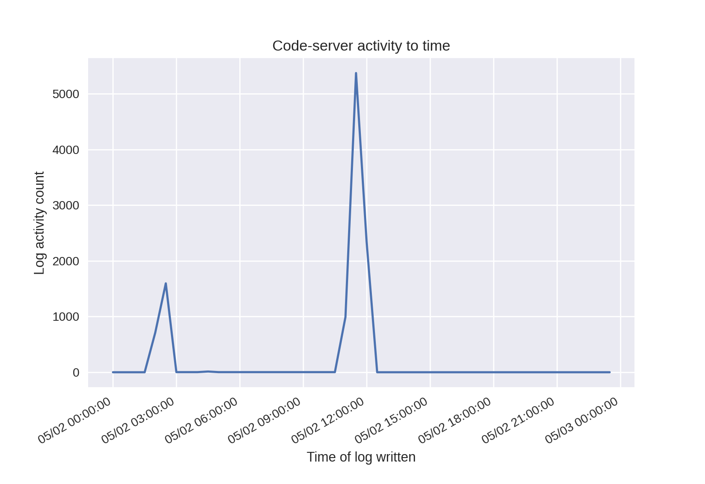
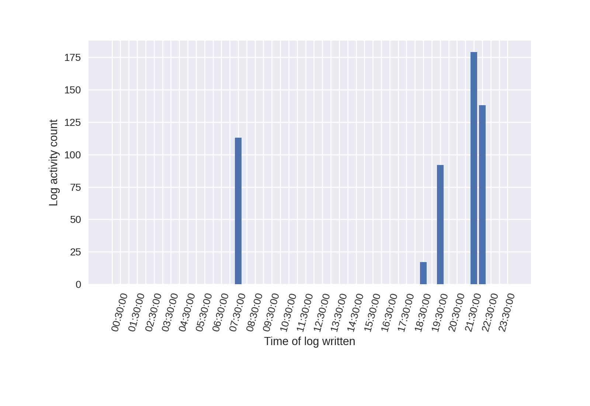

# Code-Server-Monitoring-Tool
Tool to monitor evthost.log activity for code-server, and display as a graph for analysis of anomalous behavior.

## Download Numpy and Matplotlib
To use the code, go to your _terminal_ or _command prompt_ and ensure you have Matplotlib downloaded:  
`pip install matplotlib`

## Graph examples
### Line graph:  
  
### Bar chart:
  
   
